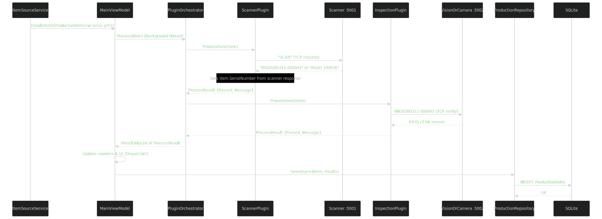

# Track & Trace Production Monitor

A modular WPF desktop application for real-time Track & Trace in serial-number-tracked voucher and secure document manufacturing environments.

> For the full HTML documentation with rendered diagrams, open [docs/architecture.html](docs/architecture.html) in a browser.

---

## Table of Contents

- [What Is This?](#what-is-this)
- [Solution Architecture](#solution-architecture)
  - [1. Solution Layers](#1-solution-layers)
  - [2. Component Diagram](#2-component-diagram)
  - [3. Item Processing Sequence](#3-item-processing-sequence)
  - [4. Plugin Interface Contract](#4-plugin-interface-contract)
  - [5. Data Model](#5-data-model)
  - [6. MVVM Data Flow](#6-mvvm-data-flow)
  - [7. Dependency Injection Registration](#7-dependency-injection-registration)
  - [8. Extension Points](#8-extension-points)
- [Projects at a Glance](#projects-at-a-glance)
- [Prerequisites](#prerequisites)
- [Getting Started](#getting-started)
- [Running the System](#running-the-system)
- [What Would Change in Real Production](#what-would-change-in-real-production)
- [Key Concepts](#key-concepts)
- [Glossary](#glossary)

---

## What Is This?

It is imagined that in a voucher or secure document factory, **every single item must be accounted for**. If 10,000 voucher sheets enter a production station, exactly 10,000 must either pass through or be recorded as rejected. No item can go missing.

**Track & Trace** means following every item through the line, recording where it was, what happened to it, and whether it passed or failed at each step - like a parcel tracking system, but for items on a production line.

This application is the **software running on an operator's screen** at a single production station. It:

1. Receives serial numbers from a barcode scanner connected to the station.
2. Runs each item through a chain of plugins (scan check, visual inspection, etc.).
3. Displays results live - green for pass, red for fail.
4. Saves every result to a local database for auditing.
5. Exports data to the factory's ERP system (CSV in this PoC; REST API in production).

---

## Solution Architecture

> Diagrams are embedded as SVG images below (rendered everywhere - GitHub, VS Code, browsers). Source Mermaid files are in [docs/diagrams/](docs/diagrams/) and the full styled reference is [docs/architecture.html](docs/architecture.html).

### 1. Solution Layers


---

### 2. Component Diagram


---

### 3. Item Processing Sequence



---

### 4. Plugin Interface Contract


---

### 5. Data Model


`PluginSummary` stores a pipe-delimited concatenation of all plugin result messages, e.g.:
`Scanner: Barcode verified | Inspection: Visual inspection passed`

---

### 6. MVVM Data Flow


---

### 7. Dependency Injection Registration


---

### 8. Extension Points


Because plugins already speak TCP and the core interfaces (`IStationPlugin`, `IProductionRepository`) never change, connecting to real hardware is often just a configuration change in `HardwareSettings`. If real hardware uses a different protocol, only that one plugin needs rewriting - nothing else changes.

---

## Projects at a Glance

| Project | Role |
|---|---|
| `TrackAndTrace.Core` | Shared contracts - interfaces, models, DTOs. No logic. |
| `TrackAndTrace.Data` | EF Core DbContext, `ProductionRepository`, SQLite persistence. |
| `TrackAndTrace.Plugins.Scanner` | `ScannerPlugin` - validates the serial number received from the scanner. |
| `TrackAndTrace.Plugins.Inspection` | `InspectionPlugin` - TCP client to the vision system; returns PASS/FAIL. |
| `TrackAndTrace.Host` | WPF application, DI bootstrap, MVVM ViewModels, background services. |
| `Simulator.Scanner` | Console app on TCP `:5001` - simulates a barcode scanner broadcasting serial numbers. |
| `Simulator.VisionOrCamera` | Console app on TCP `:5002` - simulates a camera inspection system. |

---

## Prerequisites

| Tool | Minimum version | Notes |
|---|---|---|
| .NET SDK | 8.0 | Run `dotnet --version` to verify |
| Windows OS | Windows 10 or later | Required for WPF |
| Git | Any recent version | Optional - project can also be downloaded as ZIP |

---

## Getting Started

### 1. Clone the repository

```powershell
git clone https://github.com/your-org/wpf-production.git
cd wpf-production
```

Or download and extract the ZIP from the repository page.

### 2. Restore dependencies

```powershell
dotnet restore
```

### 3. Build the solution

```powershell
dotnet build
```

All projects should report `Build succeeded` with zero errors.

---

## Running the System

The system requires **three processes** running simultaneously. Open three separate terminals:

**Terminal 1 - Vision system simulator**
```powershell
dotnet run --project src/Simulator.VisionOrCamera
```

**Terminal 2 - Scanner simulator**
```powershell
dotnet run --project src/Simulator.Scanner
```

**Terminal 3 - WPF operator dashboard**
```powershell
dotnet run --project src/TrackAndTrace.Host
```

> Start the simulators **before** the host. If you start the host first, it will automatically retry the TCP connections every few seconds until the simulators come up.

The SQLite database is created automatically on first run at:
```
%LOCALAPPDATA%\TrackAndTrace\production.db
```

Press **`Q`** in either simulator console window to shut it down.

---

## What Would Change in Real Production

| PoC (this project) | Real Production |
|---|---|
| `Simulator.Scanner` console on `:5001` | Real barcode reader over TCP / Serial / OPC-UA |
| `Simulator.VisionOrCamera` console on `:5002` | Real camera system (Cognex, Keyence, etc.) |
| SQLite `.db` file | SQL Server or Oracle on a server |
| CSV export | REST API call to SAP or other ERP |

The vision simulator returns one of 8 realistic failure reasons:

- `FAIL:Ink smear - reverse face`
- `FAIL:Misaligned serial print`
- `FAIL:Incomplete security thread`
- `FAIL:Substrate defect detected`
- `FAIL:Serial number font deviation`
- `FAIL:Ink void - portrait area`
- `FAIL:Overprint registration error`
- `FAIL:UV feature absent`

---

## Key Concepts

### Dependency Injection (DI)
Instead of a class creating its own dependencies (e.g. `new DatabaseConnection()`), they are provided from the outside by a DI container. This makes code easier to test and swap. The chef doesn't grow their own vegetables - the restaurant manager sources them.

### Plugin Contract (`IStationPlugin`)
Any class implementing `IStationPlugin` promises to have `ProcessItem()`. The orchestrator calls `ProcessItem()` on whatever it is given without needing to know whether it's a scanner plugin or an inspection plugin. Like UK power sockets - any conforming plug fits without the wall needing to know what's plugged in.

### MVVM Pattern
- **View** (XAML) - the layout; knows nothing about data.
- **ViewModel** - holds the data the view displays; knows nothing about how things look.
- **Binding** - the glue connecting them.

### Background Service (`ItemSourceService`)
Runs continuously, maintaining a TCP connection to the scanner. For every serial number received it calls `viewModel.HandleItem(item)` directly. Retries automatically if the connection drops.

---

## Glossary

| Term | Meaning |
|---|---|
| **Serial Number** | A unique ID printed/encoded on every item in production |
| **Station** | One machine or process step on the production line |
| **Track & Trace** | Recording where every item went and what happened to it |
| **ERP** | Enterprise Resource Planning - the factory's business software (e.g. SAP) |
| **Plugin** | A code module that implements `IStationPlugin` |
| **MVVM** | Model-View-ViewModel - UI pattern separating look from logic |
| **DI / IoC** | Dependency Injection - giving a class its dependencies rather than it creating them |
| **EF Core** | Entity Framework Core - translates C# classes into SQL queries |
| **SQLite** | File-based database, no server needed |
| **TCP** | Transmission Control Protocol - used here to link the app to hardware simulators |
| **OPC-UA** | Standard communication protocol used by industrial machines |
| **PoC** | Proof of Concept - a working demo to show an idea is feasible |
| **KPI** | Key Performance Indicator - total items, reject rate, etc. |
